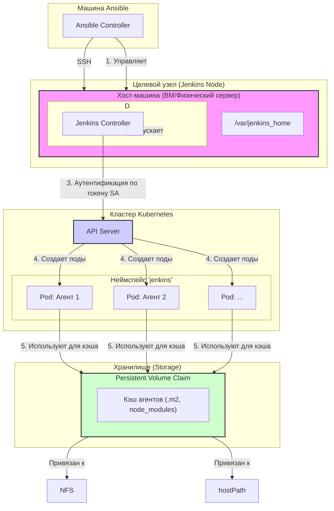

# Ansible Role: install_jenkins

Эта роль производит полную автоматическую установку и настройку контроллера Jenkins, следуя современным практикам DevOps.

Результатом работы является готовый к использованию Jenkins, который использует **Configuration as Code** для управления конфигурацией и интегрирован с **Kubernetes** для динамического запуска агентов сборки.

## Архитектура

Схема ниже описывает архитектуру развертываемого решения.



## Ключевые возможности

*   **Configuration as Code (JCasC):** Вся конфигурация Jenkins описывается в декларативном YAML-файле, что позволяет хранить ее в Git.
*   **Custom Docker Image:** Роль собирает кастомный Docker-образ Jenkins со всеми необходимыми плагинами для быстрого развертывания и неизменяемости.
*   **Интеграция с Kubernetes:** Jenkins "из коробки" настроен на запуск агентов в виде подов в Kubernetes.
*   **Безопасность по умолчанию:** Используется Service Account Token с ограниченными правами и принудительная проверка TLS-сертификата API-сервера.
*   **Гибкая настройка хранилища:** Поддерживается как `hostPath` для разработки, так и `StorageClass` для production-сред (NFS, Ceph и т.д.).

## Логика работы

Порядок выполнения основных операций соответствует шагам на схеме:
1.  **Подготовка хоста (`H`):** Ansible устанавливает Docker, создает домашнюю директорию Jenkins (`JH`) и настраивает права доступа.
2.  **Запуск Jenkins (`JC`):** Ansible собирает кастомный Docker-образ, подготавливает конфигурационные файлы (JCasC, docker-compose) и запускает контейнер Jenkins.
3.  **Интеграция с Kubernetes (`K8S_API`):** Ansible создает в кластере `ServiceAccount`, `Role`, `RoleBinding` и извлекает токен. Этот токен вместе с CA-сертификатом кластера используется для настройки "облака" Kubernetes в Jenkins.
4.  **Запуск агентов:** Когда запускается Pipeline, Jenkins Controller обращается к `K8S_API` и, используя токен, запрашивает создание пода для агента (например, `P1`).
5.  **Использование кэша:** Созданный под-агент монтирует к себе `PersistentVolumeClaim` (`S_PVC`) для кэширования зависимостей (например, `.m2` для Maven).

---

## Конфигурация роли: Переменные

Все переменные определены в `defaults/main.yml`. Для кастомизации переопределяйте их в `group_vars`.

### Общие и сетевые настройки
| Переменная | Описание | По умолчанию |
| :--- | :--- | :--- |
| `jenkins_home_on_host` | Путь к домашней директории Jenkins на хост-машине. | `/var/jenkins_home` |
| `jenkins_http_port` | HTTP-порт контроллера Jenkins. | `8080` |
| `jenkins_jnlp_port` | JNLP-порт для подключения агентов. | `50000` |
| `jenkins_url` | Внешний URL Jenkins. Если оставить пустым, определится автоматически. | `""` |
| `jenkins_tunnel` | Адрес для подключения агентов. Если оставить пустым, определится автоматически. | `""` |
| `jenkins_force_clean_install` | Полностью удаляет `jenkins_home_on_host` перед установкой для чистого старта. | `false`|

### Настройки безопасности
| Переменная | Описание | По умолчанию |
| :--- | :--- | :--- |
| `jenkins_admin_user` | Имя пользователя администратора. | `admin` |
| `jenkins_admin_password` | Пароль администратора. **Обязательно переопределить!** | `DEFAULT` |

### Управление ресурсами
| Переменная | Описание | По умолчанию |
| :--- | :--- | :--- |
| `jenkins_resource_limits_enabled` | Включить лимиты для Docker-контейнера Jenkins. | `true` |
| `jenkins_cpu_limit` | Лимит CPU (например, `'1.0'` - одно ядро). | `'1.0'` |
| `jenkins_mem_limit` | Лимит RAM (например, `'2g'`). | `'2g'` |
| `jenkins_mem_reservation`| Гарантированно выделенный объем RAM. | `'1g'` |
| `jenkins_java_opts` | Опции для JVM Jenkins. | `"-Xmx1g -D..."`|

### Настройки Docker-образа и плагинов
| Переменная | Описание | По умолчанию |
| :--- | :--- | :--- |
| `jenkins_image` | Базовый образ Jenkins для сборки. | `jenkins/jenkins:2.540-jdk21`|
| `jenkins_custom_image_name`| Имя вашего кастомного образа. | `custom/jenkins-casc`|
| `jenkins_plugins` | Основной список плагинов для "запекания" в образ. | (см. `defaults/main.yml`) |
| `jenkins_plugins_extra` | Дополнительный список плагинов (удобно для `group_vars`). | `[]` |

### Интеграция с Kubernetes (Агенты)
| Переменная | Описание | По умолчанию |
| :--- | :--- | :--- |
| `jenkins_k8s_namespace` | Неймспейс в Kubernetes, где будут создаваться агенты. | `jenkins` |
| `jenkins_k8s_service_account_name` | Имя ServiceAccount для аутентификации Jenkins. | `jenkins-admin` |
| `jenkins_k8s_agent_name` | Имя шаблона для Maven-агента в Jenkins. | `maven-agent` |
| `jenkins_k8s_agent_label` | Label для Maven-агента. | `k8s-maven` |
| `jenkins_k8s_generic_agent_name` | Имя шаблона для generic-агента (например, `alpine`). | `generic-agent` |
| `jenkins_k8s_generic_agent_label` | Label для generic-агента. | `k8s-agent` |

### Настройка хранилища (Storage)

Роль поддерживает два сценария: динамический (production) и статический (dev).

#### Режимы доступа (Access Modes)
Это ключевой параметр `PersistentVolume`.
*   `ReadWriteOnce` (RWO): Том может быть примонтирован для записи **только одним подом на одной ноде**. Подходит для `hostPath`. Если 10 пайплайнов одновременно запросят такой кэш, они будут выполняться **по очереди**.
*   `ReadWriteMany` (RWX): Том может быть одновременно примонтирован для записи **множеством подов на разных нодах**. Идеально для NFS/Ceph. Позволяет параллельно выполняющимся пайплайнам **одновременно использовать один и тот же кэш**.

#### Сценарий 1: Динамическое выделение (Рекомендуется для Production)
Используется, если в кластере есть `Storage Provisioner` (NFS, Ceph, etc.).

**Настройка в `group_vars`:**
```yaml
# Отключаем создание статического PV
jenkins_k8s_create_pv: false
# Включаем создание только PVC
jenkins_k8s_create_pvc: true
# Устанавливаем режим доступа для NFS
jenkins_k8s_pvc_access_modes: [ReadWriteMany]
# ВАЖНО: Укажите здесь имя вашего StorageClass
jenkins_k8s_pvc_storage_class: "nfs-client"
```

#### Сценарий 2: Статический `hostPath` (Только для разработки)
Для быстрого запуска на одной ноде без настройки внешнего хранилища.

**Настройка в `group_vars`:**
```yaml
# Включаем создание и PV (hostPath), и PVC
jenkins_k8s_create_pv: true
jenkins_k8s_create_pvc: true
# Для hostPath режим всегда ReadWriteOnce
jenkins_k8s_pvc_access_modes: [ReadWriteOnce]
# StorageClass должен быть пустым
jenkins_k8s_pvc_storage_class: ""
```

---
## Пример использования

```yaml
- name: Установка и настройка контроллера Jenkins
  hosts: jenkins_nodes
  become: true
  roles:
    - role: install_jenkins
```

## Зависимости
- Установленная коллекция Ansible `community.docker`.
- Сетевой доступ с хоста Ansible к целевому узлу и к API-серверу Kubernetes.
